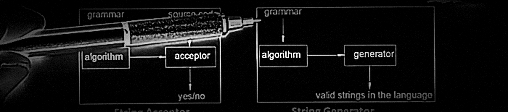

<p align="center">
  
  <br/>
  <sub><sup>screenshot from <a href="https://www.youtube.com/watch?v=tjX9Tg8l-w8">Languages and Formal Grammars</a> by Prof Ross</sup></sub>
</p>

# Recognizers

**Working thesis:** JSON schemas should compile into streaming recognizers that can
validate, constrain, and reward structured model outputs.

Recognizers is a schema-derived streaming verifier and reward-machine library
for JSON and tool-call outputs. It should not only answer "is this final JSON
valid?" It should also answer "which field did we just complete?", "which
required keys are still missing?", "what went wrong?", and "what reward event
should this prefix receive?"

| Article                                                                                                             | Code                                             | Date       |
| ------------------------------------------------------------------------------------------------------------------- | ------------------------------------------------ | ---------- |
| [Foundations: Language, Automata and Recognizers](https://www.adamsioud.com/exemplars/recognizers/foundations.html) | [foundations.py](src/recognizers/foundations.py) | 1 Mar 2026 |

---

## Project Shape

The core recognizer should stay independent of any one inference engine or
trainer. From that core, there are three modes:

- `core`: scanner, e-token stream, schema IR, compiled key IDs, semantic machine,
  events, and rewards.
- `constraint`: an inference adapter that can behave like an SGLang/XGrammar
  grammar backend, masking invalid next tokens and accepting generated tokens.
- `reward`: a learning adapter that scores free or semi-constrained model
  outputs, producing dense event traces for RL, SFT filtering, or process
  supervision.

That gives the project a clean boundary:

```text
schema
  -> recognizers-core
       -> validation events
       -> constraint masks
       -> reward traces
```

The goal is to take a JSON schema and automatically build an automaton that can
validate documents against it, guide model generation, and score model outputs.

## Current JSON Pipeline

The pipeline starts with `json_scanner.py`, which reads raw JSON and turns it into a stream of tokens. The next layer is `json_etokens.py`, which enriches those tokens into JSON e-tokens: object-key strings become `JKEY`, string values become `JSTR`, and numbers become `JNUM`. This gives the automaton a finite alphabet to work with while preserving the key/value distinction that matters for schemas.

Plain VPAs are a useful first mental model because JSON nesting is visible in the tokens: `{` and `[` push onto the stack, `}` and `]` pop, and primitives are internal symbols. But the VLDB paper "Streaming Validation of JSON Documents Against Schemas" points out the catch: object fields are unordered, so a plain VPA can blow up when it tries to encode all key permutations. The better target is a JSON automaton: a pushdown-style machine that also tracks the set of keys seen in the current object, usually as a bit vector on the stack.

The first prototype uses `json_ir.py` as a tiny internal schema language and `json_machine.py` as a semantic validator:

```python
from recognizers.json_ir import NumSchema, ObjSchema, StrSchema
from recognizers.json_machine import validate_json

schema = ObjSchema(
    properties={"name": StrSchema(), "age": NumSchema()},
    required={"name", "age"},
    additional=False,
)

machine, events = validate_json('{"name":"Adam","age":31}', schema)
print(machine.valid, machine.reward)
```

This first machine intentionally uses string keys. The next compiler layer will convert schema keys into integer IDs and bit masks, which is the version that starts looking like the paper's JSON automata.

`json_compiler.py` is that next layer. It compiles the IR into a finite key table and object required-key masks:

```python
from recognizers.json_compiler import compile_schema
from recognizers.json_machine import validate_json_compiled

compiled = compile_schema(schema)
machine, events = validate_json_compiled('{"age":31,"name":"Adam"}', compiled)
```

`json_schema_importer.py` handles the first JSON Schema subset and turns it into IR before compilation.

`json_generator.py` can produce deterministic valid examples from the same IR:

```python
from recognizers.json_generator import generate_json

source = generate_json(schema)
```

Eventually, the automaton should be constructed directly from the schema, not written by hand.

Once you have that, three things follow. You can validate documents symbol by
symbol as they stream in, without loading the whole thing first. You can generate
valid documents from the schema, which gives you training data for free. And you
can use the automaton as a reward signal: the model produces a tool call, the
machine observes the stream, and the event trace tells you which semantic
milestones were reached or missed. The same schema you already write to define a
tool becomes the thing that trains the model on it.
